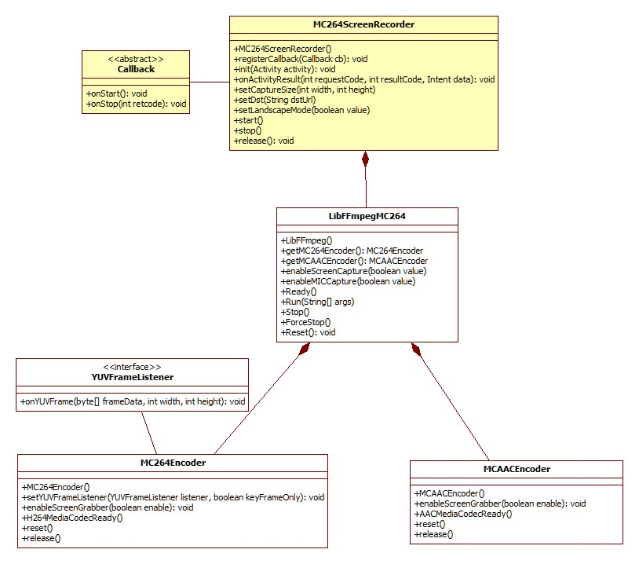

FFmpegMC264Kit
===============

FFmpegMC264Kit is a ffmpeg android library module built over android MediaCodec HW accelated encoders.  
Now, you can use two new encoders - 'mc264' / 'mcaac' - instead of 'libx264' / 'aac' in runing ffmpeg command in your code.

This library module has one java helper class - LibFFmpegMC264.java - for the native ffmpeg library.
And one java utility class - MC264ScreenRecorder.java - which can cast/save android screen to Netowrk/File. 

## Supported Color Format :
* mc264 YUV Input : yuv420p only
* MediaCodec YUV Input :  
NV12 (MediaCodecInfo.CodecCapabilities.COLOR_FormatYUV420SemiPlanar),  
YV12 (MediaCodecInfo.CodecCapabilities.COLOR_FormatYUV420Planar)

Therefor the INPUT stream of ffmpeg should have the color format of YUV420Planar. Or use '-pix_fmt yuv420p' option with INPUT. 
The MediaCodec of your device should have the color format YV12 [NV12]. (Other formats will be supported later)

## Class Diagram

  

## FFMeg source code for mc264/mcaac codecs is here :
https://github.com/iocaster/ffmpeg-4.0.mc264

## Referenced Links :
* MediaCodec example :
  - https://android.googlesource.com/platform/cts/+/jb-mr2-release/tests/tests/media/src/android/media/cts/EncodeDecodeTest.java
* Handling H.264 SPS / PPS :
  - https://github.com/Kickflip/kickflip-android-sdk/blob/master/sdk/src/main/java/io/kickflip/sdk/av/FFmpegMuxer.java
* https://stackoverflow.com/questions/24884827/possible-locations-for-sequence-picture-parameter-sets-for-h-264-stream/24890903#24890903
* https://stackoverflow.com/questions/20909252/calculate-pts-before-frame-encoding-in-ffmpeg
* http://leo.ugr.es/elvira/devel/Tutorial/Java/native1.1/implementing/index.html
* Color Format :
  - https://software.intel.com/en-us/ipp-dev-reference-pixel-and-planar-image-formats#FIG6-15
  - https://developer.android.com/reference/android/graphics/ImageFormat.html#YV12
  - https://en.wikipedia.org/wiki/YUV
* VideoKit :
  - https://github.com/inFullMobile/videokit-ffmpeg-android
  - https://github.com/IljaKosynkin/FFmpeg-Development-Kit
* Cross Compiling FFmpeg 4.0 for Android :
  - https://medium.com/@karthikcodes1999/cross-compiling-ffmpeg-4-0-for-android-b988326f16f2

